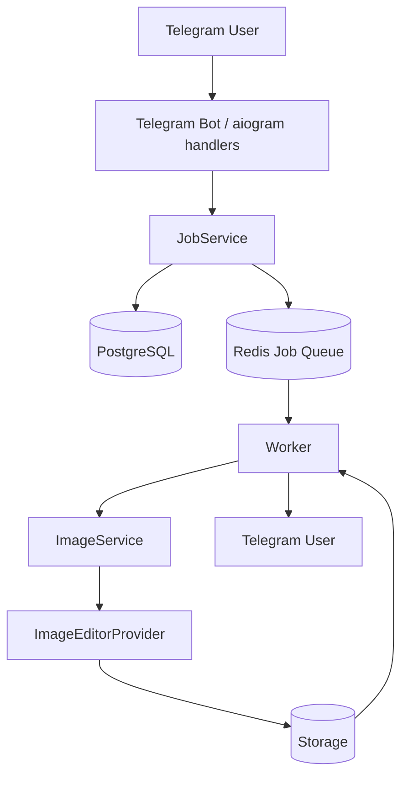

# Архитектура BMDS Bot

## Компоненты



### Telegram Bot

Aiogram принимает команды, Telegram photo и image/document. FSM хранит только состояние
диалога и безопасный серверный path. Handler не выполняет inference, SQL, Redis queue
операции или файловые операции напрямую: это делегируется сервисам.

### JobService и Database

`JobService` координирует `UserRepository`, `JobRepository` и `JobQueue`. Job сначала
фиксируется как `PENDING`, затем enqueue-ится и становится `QUEUED`. Разрешённые переходы:

```text
PENDING → QUEUED | FAILED | CANCELLED
QUEUED → PROCESSING | FAILED | CANCELLED
PROCESSING → COMPLETED | FAILED | CANCELLED
```

`parent_job_id` связывает последовательные редактирования. Результат предыдущего job можно
использовать как input следующего без изменения модели данных. ORM не выходит в handlers;
наружу API возвращает Pydantic schema.

### Redis Queue

`JobQueue` задаёт `enqueue/dequeue/close`. `RedisJobQueue` реализует простой FIFO через
`RPUSH/BLPOP`. Handler кладёт в очередь только UUID, поэтому PostgreSQL остаётся источником
истины. Rate limiting и FSM также используют Redis, но не смешаны с queue API.

### Worker

Worker создаёт один provider на процесс и вызывает `provider.startup()` до начала работы с
очередью: для `flux2_klein` это загрузка весов в GPU. Затем запускается конфигурируемое число
consumer loops, которые делят этот provider; локальный provider сам сериализует инференс
через `asyncio.Lock`. Каждый job заново загружается из БД;
terminal status пропускаются. Ошибка provider сохраняется в job и логируется с traceback,
пользователь получает только безопасное сообщение. Telegram send failure не откатывает
успешное редактирование. `cancel_requested` подавляет отправку результата.

### ImageEditorProvider — граница AI engine

Главное архитектурное правило: **ImageEditorProvider является единственной границей между
backend и AI engine**. Telegram, JobService, queue и storage не импортируют конкретную модель.

Контракт принимает input path, prompt, output path и расширяемые options. Результат содержит
список outputs и metadata. Это покрывает один/несколько результатов, локальный inference,
удалённый HTTP API и долгие GPU-задачи. Выбор реализации централизован в factory через
`IMAGE_PROVIDER`.

### Storage

`StorageService` создаёт UUID-имена внутри `input/output/temp`, разбитых по дате. MIME и
magic bytes проверяются, размер ограничивается, пользовательское имя не используется, а
resolved path контролируется относительно root. Контракт изолирует local filesystem, чтобы
позже заменить его S3/MinIO adapter-ом.

## Надёжность и дальнейшее развитие

- UUID и terminal-state check дают базовую идемпотентность.
- Сейчас Redis list может потерять взятый job при аварии между `BLPOP` и commit. Следующий
  шаг для production SLA — processing-list (`BRPOPLPUSH`) или Redis Streams с reclaim.
- Retry можно добавить в worker с `attempt_count/next_attempt_at`, не меняя Telegram layer.
- Для нескольких worker concurrency задаётся на процесс; глобальный GPU semaphore/lock можно
  реализовать через Redis.
- Local storage пригоден для одного узла. Несколько worker требуют общий volume либо S3/MinIO.
- Internal job API защищён `X-API-Key`; при появлении публичного API нужна user-scoped auth.
